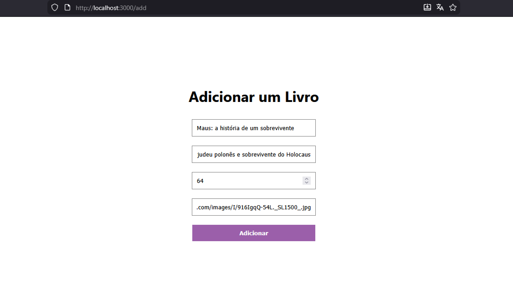

<a id="readme-topo"></a>

<div align="center">

  <h1 align="center">CRUD de Livros - React.js + MySQL</h1>
  <p>
  Projeto full stack simples desenvolvido para praticar a integração entre <b>React</b> no front-end e Node.js + Express no back-end, utilizadno <b>MySQL</b> como banco de dados relacional.
  <br>
  <a href="#sobre">sobre</a>
  &middot;
  <a href="#tecnologias-ferramentas">tecnologias e ferramentas</a>
  &middot;
  <a href="#organizacao">organização dos arquivos</a>
  &middot;
  <a href="#rotas">rotas da api</a>
  &middot;
  <a href="#configuracoes">configurações</a>
</p>
</div>

## Sobre o Repositório

<a id="sobre"></a>


> O sistema permite listar, cadastrar, atualizar e remover livros, envolvendo conceitos sobre back-end, API REST e persistência de dados.



> página para adicionar um novo livro, indêntica a de atualizar.

### Funcionalidades

- Listagem dinâmica de livros via API
- Cadastro de novos livros com formulário
- Atualziação de livros por ID
- Exclusão de livros
- Navegação entre páginas com React Router
- Comunicação com API usando Axios

### Conceitos Aplicados

- Integração front-end e back-end
- Implementação de operações CRUD com banco de dados relacional
- Estruturação de uma API REST simples
- Organização básica de um sistema full stack

<br>

Com o objetivos de retomar o uso de React após muito tempo, aprender e praticar pela primeira vez o MySQl (experiÊncia penas com PostgresSQL) e revisar fundamentos de Node.js + Express.

<p align="right">(<a href="#readme-topo">voltar ao topo</a>)</p>

## Tecnologias e Ferramentas

<a id="tecnologias-ferramentas"></a>

Ambiente & Desenvolvimento (usado em todo o projeto)

- VS Code – Editor de código principal
- npm – Gerenciador de pacotes do Node.js
- JavaScript – Linguagem base do projeto

Backend (servidor/API) e Banco de Dados (armazenamento)

- Node.js – Ambiente de execução JavaScript no servidor
- Express – Framework para criação da API REST
- MySQL – Sistema de banco de dados relacional
- CORS – Middleware para permitir requisições entre diferentes origens
- Dotenv – Gerenciamento de variáveis de ambiente
- Nodemon – Reinício automático do servidor durante desenvolvimento
- Postman – Teste de endpoints da API
- MySQL Workbench – Interface gráfica para gerenciamento do banco de dados

Frontend (interface do usuário)

- React – Biblioteca para construção da interface com componentes
- React Router DOM – Sistema de navegação entre páginas
- Axios – Cliente HTTP para comunicação com a API
- CSS – Estilização visual dos componentes

<p align="right">(<a href="#readme-topo">voltar ao topo</a>)</p>

## Organização dos Arquivos

<a id="organizacao"></a>

```

crud-livros/
├── backend/
│   ├── index.js
│   ├── package.json
│   └── .env
│
└── frontend/
    ├── src/
    │   ├── pages/
    │   │   ├── Books.js
    │   │   ├── Add.js
    │   │   └── Update.js
    │   ├── App.js
    │   └── style.css
    ├── package.json
    └── public/
```

<p align="right">(<a href="#readme-topo">voltar ao topo</a>)</p>

## Rotas da API

<a id="rotas"></a>

| Método   | Rota         | Descrição                   |
| :------- | ------------ | --------------------------- |
| `GET`    | `/`          | Teste de conexão            |
| `GET`    | `/books`     | Lista todos os livros       |
| `POST`   | `/books`     | Cria um novo livro          |
| `PUT`    | `/books/:id` | Atualiza um livro existente |
| `DELETE` | `/books/:id` | Remove um livro             |

<p align="right">(<a href="#readme-topo">voltar ao topo</a>)</p>

## Configurações

<a id="configuracoes"></a>

**instalação de dependências**

```bash
cd backend
npm install
```

```bash
cd frontend
npm install
```

<br>

**arquivo .env** (criar um arquivo .env na pasta backend)

```ini
DB_HOST=localhost
DB_USER=seu_usuario (geralmente root)
DB_PASSWORD=sua_senha
DB_NAME=nome_do_banco
```

<br>

**tabela books**

```SQl
CREATE YABLE books(
  id INT AUTO_INCREMENT PRIMARY KEY,
  title VARCHAR(45),
  description VARCHAR(255),
  price INT,
  cover VARCHAR(255)
);
```

**execução**

```
npm start
```

<br>

**backend disponível em:**

```
http://localhost:8800
```

<br>

**frontend disponível em:**

```
http://localhost:3000
```

<br>

<p align="right">(<a href="#readme-topo">voltar ao topo</a>)</p>
